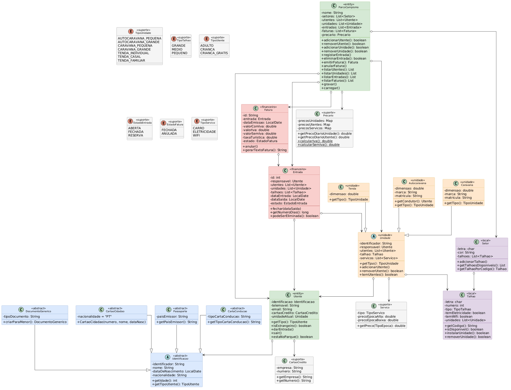
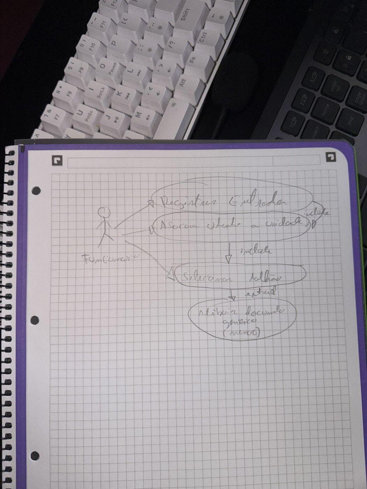
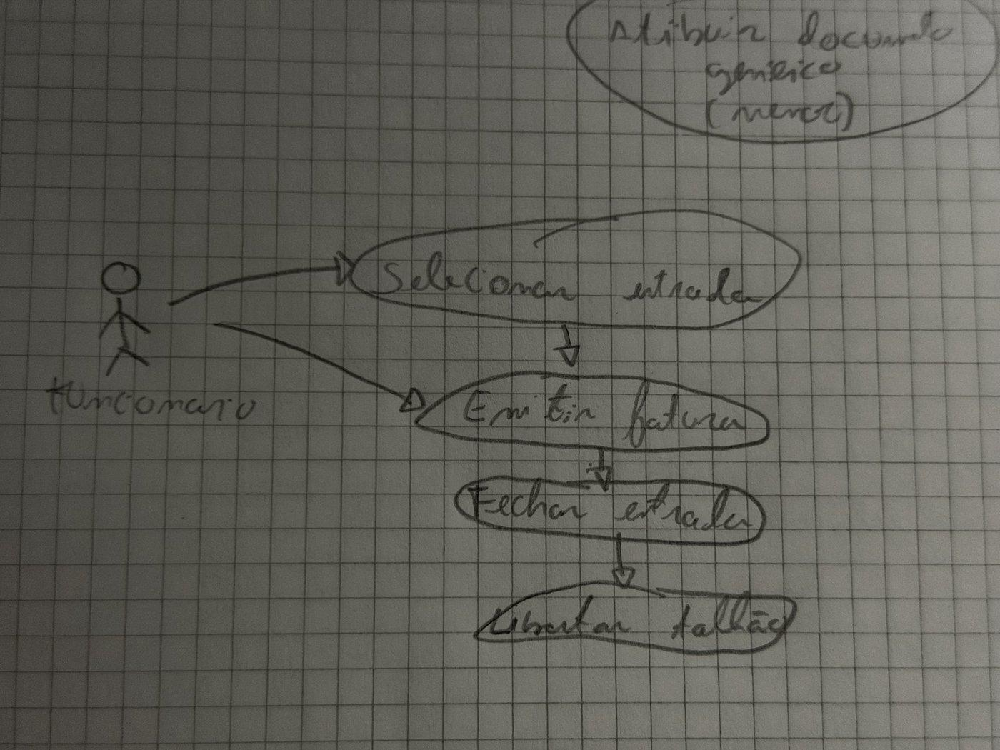
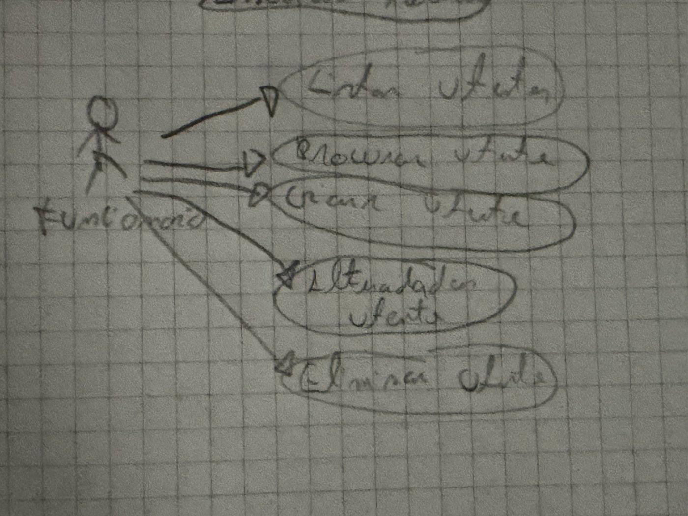

# Campsite Management System — Analysis & Design (Phase 1) 🏕️

Object-oriented analysis and design for a campsite management system ("Gestão de um Parque de Campismo"), built as a university coursework project. This repository covers **Phase 1**: requirements analysis, entity/class modeling, and UML design — no implementation code yet (that's Phase 2).

**Course:** Fundamentos de Programação Orientada a Objetos (Object-Oriented Programming Fundamentals)
**Program:** CTeSP TPSI, Escola Superior de Tecnologia de Setúbal — Instituto Politécnico de Setúbal
**Academic year:** 2025/2026

## What the system does

Manages a campsite front-office end to end: registering guests ("utentes") and their units (motorhome, caravan, or tent) into plots ("talhões"), tracking stays ("entradas") from check-in to check-out, and issuing invoices with tourist tax and VAT applied. The system was designed to be implemented in Java, console-based, in NetBeans.

## Assignment brief

This is an **individual** project (not a group assignment) for Fundamentos de Programação Orientada a Objetos. The official brief — full requirements, pricing tables, plot-occupancy rules, and the grading rubric — is in [`docs/enunciado.pdf`](docs/enunciado.pdf), with the base specification document it was built from in [`docs/especificacao_sistema.docx`](docs/especificacao_sistema.docx) and the noun/verb analysis methodology (CRC cards) in [`docs/anexo1_metodologia.pptx`](docs/anexo1_metodologia.pptx).

The project runs in three graded phases:

| Phase | Deliverable | Weight |
|---|---|---|
| 1 | Requirements analysis & UML design (this repo) | 35% |
| 2 | Full Java implementation in NetBeans, prototype with all required features | 65% |
| — | Mandatory oral defense each phase | pass/fail on code ownership |

Submissions go through Moodle and are checked with MOSS for plagiarism; each phase also requires defending the code orally to prove it's genuinely the student's own work.

## Methodology

Requirements were analyzed using the noun/verb method: entities and actions were extracted directly from the assignment brief, cross-referenced into entity–action–description tables, then modeled into class candidates with attributes and methods. Use case diagrams were sketched for the main flows, and every ambiguity or inconsistency found in the brief was documented along with the design decision taken to resolve it.

## Key design decisions

- **Identification is polymorphic:** `Identificacao` is an abstract superclass with `CartaoCidadao`, `Passaporte`, `CartaConducao`, and `DocumentoGenerico` (auto-assigned to children under 5 without their own ID) as subclasses.
- **Units share a common contract:** `Unidade` is an abstract superclass for `Autocaravana`, `Caravana`, and `Tenda`, each with different attributes (dimensions, plate, driver) but a common association to a plot.
- **A stay ("Entrada") aggregates guests, units, and plots** and can only be removed once it has none of either. Removing a guest/unit from an open stay closes it (issuing an invoice) and opens a new one for whoever remains.
- **Invoices are immutable once closed** — they can only be voided ("anulada"), never edited or deleted, matching real invoicing rules.
- **Pricing is seasonal:** high season (Jun 15 – Sep 15) vs. low season, applied per unit type and guest type, plus a €1/day tourist tax for foreign adult guests.

## UML class diagram

## Use case diagrams

**Check-in — registering a stay with a unit**

**Check-out — closing a stay and issuing an invoice**

**Guest management — create, search, update, remove**

## Full report

The complete write-up — entity/verb tables, full class candidate table with attributes and methods, all use case scenarios, and every documented assumption — is in [`docs/relatorio_fase1.pdf`](docs/relatorio_fase1.pdf) (Portuguese).

## Documents

- [`docs/relatorio_fase1.pdf`](docs/relatorio_fase1.pdf) / [`.docx`](docs/relatorio_fase1.docx) — the Phase 1 deliverable (this student's analysis and design work)
- [`docs/enunciado.pdf`](docs/enunciado.pdf) — official assignment brief, pricing tables, occupancy rules, and grading rubric
- [`docs/especificacao_sistema.docx`](docs/especificacao_sistema.docx) — base system specification the noun/verb analysis was applied to
- [`docs/anexo1_metodologia.pptx`](docs/anexo1_metodologia.pptx) — noun/verb + CRC card methodology reference
- [`docs/template_relatorio.docx`](docs/template_relatorio.docx) — report template provided by the instructor

## Status

✅ Phase 1 — Requirements analysis & OOP design (this repo)
⏳ Phase 2 — Java implementation (not started yet)

## Author

Diego Teran

## License

MIT — see [LICENSE](LICENSE).
